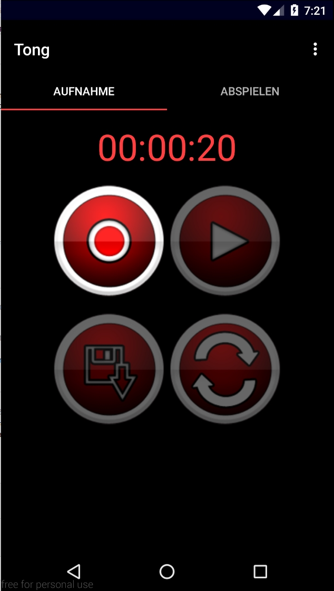
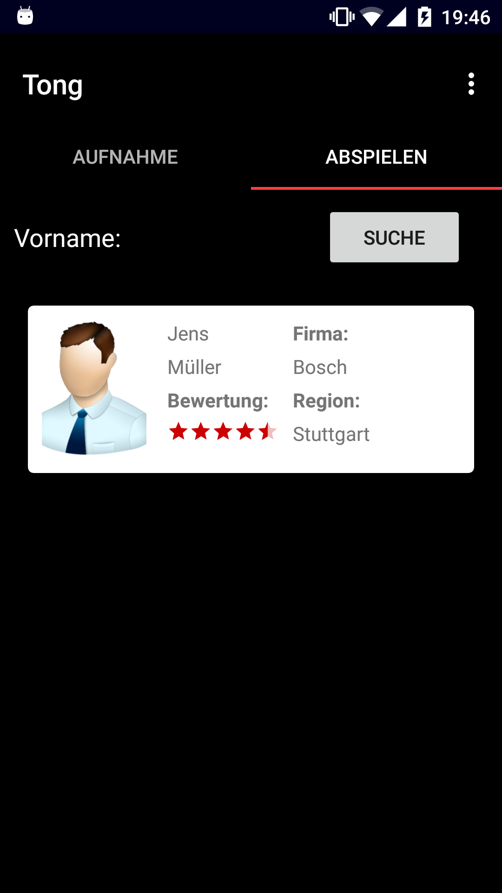

# Tong

**"Tong"** (sprich wie engl. tongue) hat zwei Hauptfunktionen. Einmal das Aufnehmen von gesprochenen Namen und das Abspeichern dieser mit dem geschriebenen Namen. Das Zweite ist das Durchsuchen und dann Abspielen der schon aufgenommen Namen.
Die App versucht ein Problem der Sprachbarriere mit Namen zu lösen. Wenn Unternehmen Kunden in anderen Ländern erreichen und mit ihnen kommunizieren wollen, ist es, um seriös und höflich aufzutreten, wichtig die Namen, die sich in der Aussprache sehr von unseren abweichen, richtig auszusprechen. **"Tong"** bietet eine Hilfe an, die Namen und dessen Aussprache miteinander zu verbinden, zu üben und in z.B. Meetings dann korrekt zu benutzen.

## Features

### Aufnahme speichern, abspielen

Screenshot of Tong Main Screen by Alexander Ziegler, Manuel Kloppenburg, Jens Müller, CC BY-SA 3.0

Die Aufnahme kann aufgenommen und abgespeichert werden. Außerdem ist es möglich sie abzuspielen.

### Aufnahmen verwalten

Screenshot of Tong Search Screen by Alexander Ziegler, Manuel Kloppenburg, Jens Müller, CC BY-SA 3.0

Die Verschieden Personen können durchsucht werden und dann bearbeiten und gelöscht werden.

## Verwendung der App

### Wichtiger Anwendungsfall 1
Ein wichtiger Kunde aus einem anderen Land hat den einen besonderen Namen, dieser wird ggf. anders ausgesprochen als man es auf den ersten Blick erahnen kann. Daher soll die App helfen den Namen des Kunden korrekt zu lernen.

### Wichtiger Anwendungsfall 2
Um Kundennamen von anderen Vertrieblern zu lernen besteht die Möglichkeit eine mündliche Überlieferung des Namens zu nutzen, welche schnell vergessen werden kann, oder man legt sich einen neuen Kunden an, sodass man den korrekten Namen des Kunden immer parat hat und somit vorbereitet ist für das Treffen mit dem Kunden.

## APK
> Die APK wurde zum Meilenstein 5 erstellt und liegt im Wurzelverzeichnis

[APK](Tong.apk)

## Lizenz

[Lizenz](LICENSE)