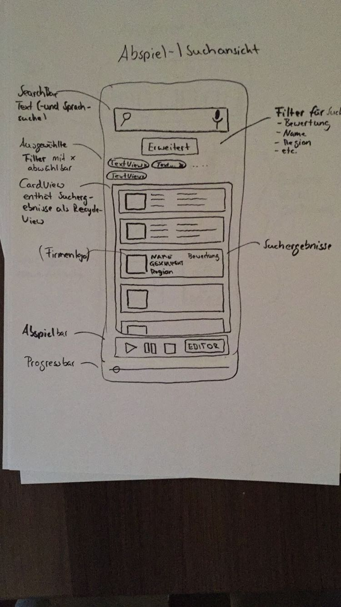

 # Einführung

Die App hat eine Oberfläche (GUI), die mit dem Nutzer interagiert und über diese wird auch die App gesteuert. Die Daten werden in einer Datenbank auf dem Android-Gerät abgelegt und zur Verfügung gestellt. Der Nutzer kann die Daten verwenden.
Wir erachten das Model-View-Controller Entwurfsmuster als sinnvoll und dieses Muster bildet die Basisstruktur unserer App.

# Komponentendiagramm

## Komponente Oberfläche

Die Oberfläche enthält das Graphical User Interface (GUI). Die Oberfläche stellt die Daten dem Nutzer graphisch dar. Sie benutzt die von der Steuerungs- und Aufnahmekomponente angebotenen Funktionen und stellt sie dar. Die Oberflächenkomponente ist von der Datenbankskomponente und der Verwaltungskomponente abhängig, da sie ohne diese nichts anzeigen kann.

## Komponente Steuerung und Aufnahme

Die Steuerungs- und Aufnahmekomponente enthält die Logik der Steuerung der App. Sie reagiert auf die Eingabe des Benutzers und führt aufgrunddessen Aktionen aus. Sie bekommt von der Verwaltung Daten angeboten, die sie dafür nutzt.

## Komponente Verwaltung

Die Verwaltungskomponente verwaltetet die Daten. Sie bekommt die Daten von der Datenbank angeboten und stellt sie auf Anfrage der Steuerungs- und Aufnahmekomponente zur Verfügung.

## Komponente Datenbank

Die Datenbankkomponente speichert alle Daten und stellt sie der Verwaltungskomponente zur Abrufung zur Verfügung.

# Klassendiagramm

## Beschreibung der wichtigen Klassenhierarchie:
Zentrale Ebene des Klassenkomplexes wird die MainActivity Klasse, welche die Struktur der App vorgibt und die Frames, sowie das Overflow Menü verwaltet. In ihr sind lediglich die AdapterKlassen des Fragments enthalten welche beim Klicken auf eines Tabs ein neues Objekt des Fragmentes erstellt und innerhalb des Containers öffnet.

## Beschreibung der Klasse Options
SubKlasse der MainActivity welche die Optionen bereit stellt und mittels .ini Datei ein bzw. ausliest. (AdditionalFeature)

## Beschreibung der Klasse ImportExport
SubKlasse der MainActivity welche die Import/Export Funktionen bereit stellt und mittels sie in die Datenbank einliest (Additional Feature)

## Beschreibung der Klasse MediaPlayerMain
Enthält die Funktionen, die wir benötigen um eine Person anzulegen, d.h. die Aufnahme Funktion, das Temporäre Abspielen der Aufnahme, das Verwerfen der Aufnahme, sowie das Abspeichern der Aufnahme.

## Beschreibung der Klasse SavaData
Ist die SubClass des MediaPlayerMain und enthält eine eigene Activity. Hier wird erst die Verbindung zur Datenbank erstellt, sodass die Temporär gespeicherten Daten nun persistent Gespeichert werden.

## Beschreibung der Klasse SearchMain
Ist die Klasse für das Anzeigen aller bisher getätigten Einträge. Sie wird mittels eiens SearchViews (Additional Features) erweitert. Die Klasse Realisiert sich via AdapterKlassen RecyclerViewAdapter und SearchViewAdapter, welche die Ergebnisse der Liste nach dem Kriterium sortiert.

## Beschreibung der Klasse RecyclerViewAdapter
AdapterKlasse zur Darstellung der Liste, der Personen, die Persistent gespeichert sind.

## Beschreibung der Klasse SearchViewAdapter
AdapterKlasse die Filter zum Anzeigen der Personen, die Persistent gespeichert sind, zur Verfügung stellt.

## Beschreibung der Klasse ContactCard
SubKlasse des SearchViews welches eine einzelne Person Darstellt. Innerhalb der Klasse kann man die gespeicherte AudioDatei direkt abspielen die Person direkt löschen oder eine weitere Activity aufrufen in der die Person oder die AudioDatei bearbeitet werden kann.

## Beschreibung der Klasse EditPerson
Die Klasse EditPerson enthält die wichtigsten Funktionen zum Bearbeiten einer einzelnen Kontakt Person

## Beschreibung der Klasse EditMedia
Die Klasse EditMedia enthält die wichtigsten Funktionen zum temporären Bearbeiten einer AudioDatei von der ausgewählten Person.

## Beschreibung der Klasse DatabaseAdapter
Die Klasse DatabaseAdapter enthält alle Funktionen die zum Speichern, anlegen oder Edititeren der Datenbank wichtig sind.

# GUI-Skizzen

GUI-Skizze von Alexander Ziegler, CC-BY-SA 4.0

** Hauptmenu Funktionsskizze**
Das Hauptmenü ist mittels eines Swipe-Tab realisiert. Es existieren 4 Tabs (Aufnahme, Abspielen, Audio-Bearbeiten und Personen-/Datenverwaltung)

Die Leiste über den Tabs enthält neben dem Firmenlogo (EPlan), auch den Appnamen, den Namen des aktuell aktiven Tabs und ein Overflow Icon für die Einstellungen.

GUI-Skizze von Alexander Ziegler, CC-BY-SA 4.0

** Abspiel Funktionsskizze **

Die Abspiel-Aktivity ist gezeichnet durch eine Suchleiste, in der man eine Suche durchführen kann, welche nach allen Kriterien sucht. Sollte eine genauere Suche erwünscht sein so existiert direkt unter der Suchleiste ein Button 'Erweitert'. Durch diesen kann man mithilfe eines AlertDialogs einzelne Suchkriterien auswählen und es wird nur nach diesen gesucht. Jedes gewähltes Suchkriterium wird unterhalb des Buttons angezeigt, welche auch dort direkt durch das klicken des x Symboles abgewählt werden können.

Ist die Suche erfolgreich, so werden die Ergebnisse in der unten stehenden CardView angezeigt. Man kann dort den gewünschten Eintrag auswählen und ihn direkt abpsielen lassen. Ein erneutes Abspielen oder Pausieren erfolgt mit Hilfe der Medienleiste die sich direkt unterhalb der Liste befindet. Dort haben wir auch den direkten Einstieg in die Editierfunktion.

GUI-Skizze von Alexander Ziegler, CC-BY-SA 4.0

** Speichern Funktionsskizze **

Enthält zwei CardViews, welche einmal die Metadaten der Person und einmal die Metadaten der Audiodatei anfordert.

Die erste Formularansicht enthält alle wesentlichen Daten für einen Kunden u.a. die Name, Geschlecht, Region, Firma, usw.

Die Metadaten der Audiodatei werden mittels Sternesystem bewertet. Ein zusätzliches Feld für einen Kurztext für die Audiodatei ist ebenfalls enthalten.

GUI-Skizze von Alexander Ziegler, CC-BY-SA 4.0

** Aufnahme Funktionsskizze **
Die Ansicht des Aufnahmemenüs.

Ganz oben wird die Zeit angezeigt der Aufnahme angezeigt. Direkt darunter ist eine Progressbar, die die Begrenzung der Aufnahmezeit begrenzt.

Die darunterliegenden Buttons steuern die einzelnen Aktionen der Aufnahme. Es existieren (mindestens) Sechs Buttons, die die einzelnen Funktionen der Aufnahme steuern.

Repeat-Button
Er setzt die Aufnahme zurück.

Record-Button
Er lässt die Aufnahme starten.

Play-Button
Er lässt die gerade aufgenommene Aufnahme abspielen.

Stop-Button
Er beendet die aktuelle Aufnahme.

Save-Button
Er lässt die gewünschte Aufnahme abspeichern (neue Activity).

Delete-Button
Er lässt die bisher aufgenommene Aufnahme löschen und verwirft die komplette Aufnahme.

GUI-Skizze von Alexander Ziegler, CC-BY-SA 4.0

** Edition Funktionsskizze **
Die letzte Ansicht enthält vier wesentliche Elemente.

Zum Einen die Headline Box. Eine CardView, welche die wesentlichen Metadaten der Audiodatei anzeigt, die gerade bearbeitet wird.

Die zweite Box ist eine graphische Ansicht (eventuell mittels des Nyquist-Shannon-Theorem's) der Audioanalyse.

Die dritte Box ist eine Ansammlung von Buttons die zwischen den Bearbeitungsoptionen enscheiden lässt.

Nach dem betätigen einer Bearbeitungoption stehen dem Nutzer in der vierten und letzten Box die gewünschte Funktion zur Verfügung.
Geplant sind Funktionen die die Geschwindigkeit, die Lautstärke, die Länge der Audiodatei bearbeitet, ein eventuelles Rauschen unterdrückt, Effekte hinzufügt und die Metadaten der gespeicherten Datei verändern kann.